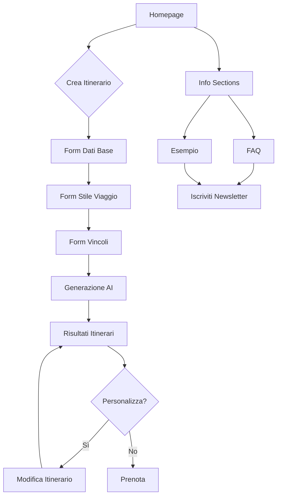

## 1. Product Overview

ItinerAI è una piattaforma di pianificazione viaggi che utilizza intelligenza artificiale per creare itinerari personalizzati in pochi minuti. Gli utenti inseriscono destinazione, date e preferenze, e l'AI genera 2-3 proposte di viaggio complete con voli, alloggi, esperienze e ristoranti già ottimizzati.

Il prodotto risolve il problema della ricerca dispersiva e complessa per organizzare un viaggio, offrendo un'esperienza semplificata e personalizzata per viaggiatori che vogliono risparmiare tempo e ottenere risultati di qualità.

## 2. Core Features

### 2.1 User Roles

| Role | Registration Method | Core Permissions |
|------|---------------------|------------------|
| Visitatore | Nessuna registrazione richiesta | Può visualizzare il sito e iscriversi alla newsletter |
| Utente Registrato | Email + conferma | Può creare e salvare itinerari, accedere a cronologia |

### 2.2 Feature Module

Il sito ItinerAI consiste nelle seguenti pagine principali:

1. **Homepage**: Presentazione del servizio, caratteristiche principali, call-to-action per creare itinerario, sezioni informative (come funziona, perché ItinerAI, esempio, FAQ, contatti).

2. **Pagina Crea Itinerario**: Form multi-step per inserire dati viaggio (destinazione, date, viaggiatori, budget, ritmo, interessi), preferenze speciali, vincoli esistenti, generazione AI dell'itinerario.

3. **Pagina Risultati Itinerario**: Visualizzazione degli itinerari generati, opzioni di personalizzazione, dettagli giorno per giorno, link per prenotazioni.

### 2.3 Page Details

| Page Name | Module Name | Feature description |
|-----------|-------------|---------------------|
| Homepage | Hero section | Presenta il valore principale con titolo accattivante e CTA principale per iniziare. Mostra i 3 step del processo con icone e descrizioni. |
| Homepage | Navigation | Menu fisso in alto con logo, link a sezioni page, bottone CTA prominent. Responsive con hamburger menu su mobile. |
| Homepage | Come funziona | 4 step illustrati del processo (inserisci dati, definisci stile, AI costruisce, tu scegli) con icone e spiegazioni dettagliate. |
| Homepage | Perché ItinerAI | Confronto tabellare tra viaggio senza AI, agenzia classica e ItinerAI, con statistiche e benefici chiari. |
| Homepage | Esempio itinerario | Esempio pratico di 3 giorni a Roma con dettagli orari, attività, ristoranti, distanze e note AI. |
| Homepage | FAQ | Lista espandibile di domande frequenti con animazione accordion, copre costi, modifiche, bambini, tecnologia. |
| Homepage | Contatti | Form email per iscriversi alla lista d'attesa, CTA principale, informazioni legali nel footer. |
| Crea Itinerario | Form base | Campi per destinazione, date partenza/ritorno, numero e tipo viaggiatori con icone e validazione. |
| Crea Itinerario | Form stile | Selettori per budget (economico/medio/comfort), ritmo (tranquillo/equilibrato/intenso), interessi multi-selezione. |
| Crea Itinerario | Form vincoli | Checkbox per esigenze speciali (bambini, mobilità ridotta), campi per alloggio/trasporto già prenotati, note libere. |
| Crea Itinerario | Riepilogo | Panel laterale con riepilogo in tempo reale dei dati inseriti, validazione e CTA per generazione. |
| Crea Itinerario | Generazione | Schermata di loading animata con 3 step di generazione, progress bar e messaggi rassicuranti. |
| Risultati Itinerario | Lista proposte | Cards con antepima degli itinerari generati, punteggio di compatibilità, durata, budget stimato. |
| Risultati Itinerario | Dettagli itinerario | Vista giorno per giorno con orari, attività, ristoranti, mappe, distanze, note pratiche. |
| Risultati Itinerario | Personalizzazione | Opzioni per modificare attività, aggiungere/rimuovere tappe, cambiare ristoranti, aggiustare tempi. |
| Risultati Itinerario | Prenotazione | Link diretti a partner di prenotazione per voli, hotel, attività, ristoranti con tracking. |

## 3. Core Process

### Flusso Utente Principale:
1. Utente atterra sulla homepage e legge il value proposition
2. Clicca su "Crea il tuo itinerario" o "Inizia ora"
3. Viene portato al form di creazione itinerario
4. Compila i dati base (destinazione, date, viaggiatori)
5. Seleziona stile di viaggio (budget, ritmo, interessi)
6. Aggiunge eventuali vincoli o preferenze speciali
7. Invia il form e vede schermata di generazione
8. Riceve 2-3 proposte di itinerario personalizzate
9. Può visualizzare dettagli, personalizzare o procedere alla prenotazione

### Flusso Utente Secondario:
1. Utente naviga homepage per informazioni
2. Legge sezioni "Come funziona", "Perché ItinerAI", esempio
3. Consulta FAQ per dubbi
4. Si iscrive alla lista d'attesa se non pronto a prenotare
5. Riceve aggiornamenti via email

## 4. User Interface Design

### 4.1 Design Style

**Colori Principali:**
- Primario: `#1A2B4C` (blu scuro) per testi principali e header
- Secondario: `#2F80ED` (blu medio) per elementi interattivi e link
- Accento: `#FF8A3D` → `#E67628` (arancione gradient) per CTA e elementi importanti
- Sfondi: `#F5F7FB` (grigio chiaro) per aree di contenuto
- Testo: `#5B6473` (grigio scuro) per testo secondario

**Stile Componenti:**
- Bottoni: Rounded-lg (8px) con gradient arancione per CTA principali, bordo solido per secondari
- Card: Rounded-xl (12px) con ombra soft e hover effects
- Input: Bordo-2 con focus state in blu, icone integrate
- Layout: Card-based con spaziatura generosa e grid system responsive

**Tipografia:**
- Font: System fonts con fallback sans-serif
- Titoli: Bold (700-900) con dimensioni da text-3xl a text-6xl
- Corpo: Regular (400-500) con dimensioni da text-sm a text-xl
- Interlinea: Leading-relaxed per leggibilità ottimale

**Icone:**
- Lucide React per consistenza e qualità
- Dimensioni: w-5 h-5 per testo, w-8 h-8 per features, w-10 h-10 per hero
- Colori: Coerenti con palette o bianche su sfondi colorati

### 4.2 Page Design Overview

| Page Name | Module Name | UI Elements |
|-----------|-------------|-------------|
| Homepage | Hero section | Background gradient da bianco a blu chiaro, titolo 6xl bold in blu scuro, sottotitolo 2xl grigio, due CTA prominenti con icone, 3 cards feature con icone circolari gradiente. |
| Homepage | Navigation | Header fisso bianco con blur, logo + testo, menu link hover color change, CTA button gradient arancione con shadow. |
| Crea Itinerario | Form sections | Background grigio chiaro, card bianca rounded-2xl, step headers con bordo arancione, input con icone integrate, bottoni selezione multipli con stati attivi arancione. |
| Crea Itinerario | Generazione | Schermata loading con spinner animato, progress bar arancione, checklist steps con icone stato, messaggi rassicuranti, animazioni smooth. |

### 4.3 Responsiveness

- **Desktop-first**: Design ottimizzato per schermi desktop (1280px+), adattamento progressivo per tablet e mobile
- **Grid system**: Da 3 colonne su desktop a 1 colonna su mobile
- **Breakpoint**: sm (640px), md (768px), lg (1024px), xl (1280px)
- **Touch optimization**: Bottoni grandi minimo 44px, spaziature aumentate su mobile
- **Mobile navigation**: Hamburger menu con slide-in drawer per schermi <768px