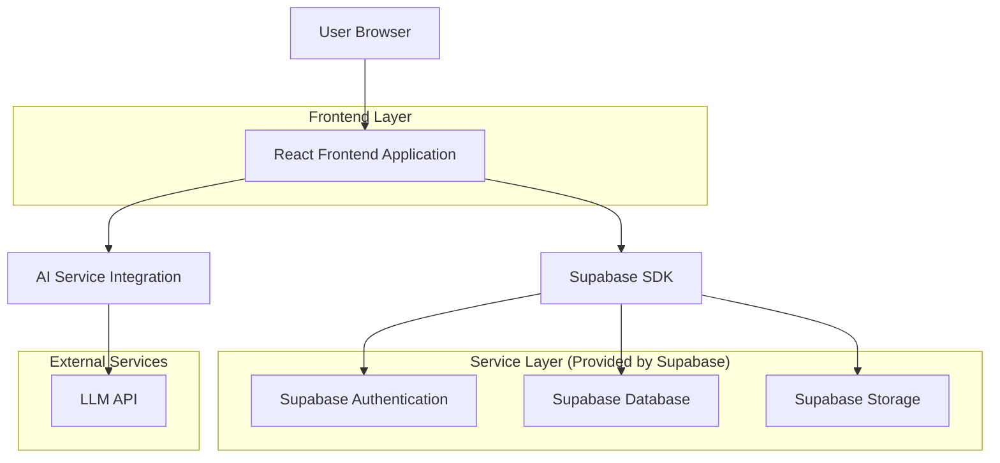
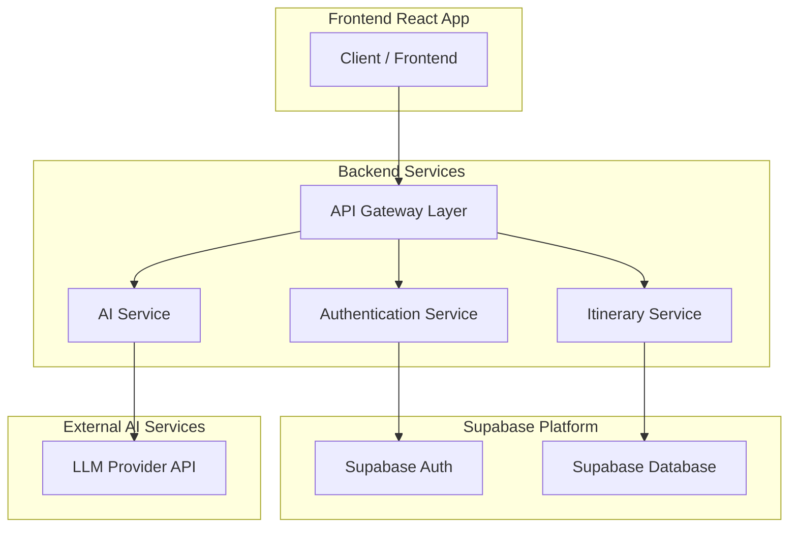
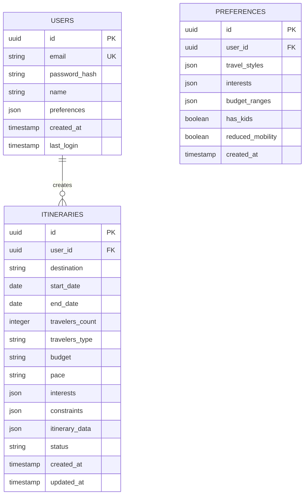

## 1. Architecture design



## 2. Technology Description

- **Frontend**: React@18 + TypeScript + TailwindCSS@3 + Vite
- **Initialization Tool**: vite-init
- **Backend**: Supabase (BaaS)
- **State Management**: React hooks (useState, useEffect)
- **Routing**: React Router DOM (to be implemented)
- **Icons**: Lucide React
- **AI Integration**: Custom service layer for LLM API calls

## 3. Route definitions

| Route | Purpose |
|-------|---------|
| / | Homepage con presentazione servizio e CTA |
| /create | Form creazione itinerario multi-step |
| /itineraries | Lista itinerari salvati dell'utente |
| /itinerary/:id | Dettaglio singolo itinerario con opzioni di modifica |
| /auth/login | Pagina login utente |
| /auth/register | Pagina registrazione nuovo utente |
| /profile | Profilo utente con dati e preferenze |

## 4. API definitions

### 4.1 Authentication APIs

```
POST /auth/v1/token
```

Request:
| Param Name | Param Type | isRequired | Description |
|------------|-------------|-------------|-------------|
| email | string | true | Email dell'utente |
| password | string | true | Password in chiaro |

Response:
| Param Name | Param Type | Description |
|------------|-------------|-------------|
| access_token | string | JWT token per autenticazione |
| refresh_token | string | Token per rinnovo sessione |
| user | object | Dati utente completo |

### 4.2 Itinerary APIs

```
POST /rest/v1/itineraries
```

Request:
| Param Name | Param Type | isRequired | Description |
|------------|-------------|-------------|-------------|
| destination | string | true | Città o paese destinazione |
| start_date | date | true | Data inizio viaggio |
| end_date | date | true | Data fine viaggio |
| travelers_count | integer | true | Numero di viaggiatori |
| budget | string | true | Budget: economico/medio/comfort |
| pace | string | true | Ritmo: tranquillo/equilibrato/intenso |
| interests | array | false | Array di interessi selezionati |
| notes | string | false | Note aggiuntive utente |

Response:
| Param Name | Param Type | Description |
|------------|-------------|-------------|
| id | uuid | ID univoco itinerario |
| created_at | timestamp | Data creazione |
| status | string | Stato: draft/generated/completed |
| itinerary_data | json | Dati completi itinerario generato |

### 4.3 AI Generation API

```
POST /api/ai/generate-itinerary
```

Request:
| Param Name | Param Type | isRequired | Description |
|------------|-------------|-------------|-------------|
| destination | string | true | Destinazione principale |
| preferences | object | true | Oggetto con tutte le preferenze utente |
| constraints | object | false | Vincoli specifici (bambini, mobilità, etc.) |

Response:
| Param Name | Param Type | Description |
|------------|-------------|-------------|
| itineraries | array | Array di 2-3 proposte itinerario |
| confidence_score | number | Punteggio affidabilità AI |
| generation_time | number | Tempo generazione in secondi |

## 5. Server architecture diagram



## 6. Data model

### 6.1 Data model definition



### 6.2 Data Definition Language

**Users Table**
```sql
-- create table
CREATE TABLE users (
    id UUID PRIMARY KEY DEFAULT gen_random_uuid(),
    email VARCHAR(255) UNIQUE NOT NULL,
    password_hash VARCHAR(255) NOT NULL,
    name VARCHAR(100) NOT NULL,
    preferences JSONB DEFAULT '{}',
    created_at TIMESTAMP WITH TIME ZONE DEFAULT NOW(),
    last_login TIMESTAMP WITH TIME ZONE,
    updated_at TIMESTAMP WITH TIME ZONE DEFAULT NOW()
);

-- create indexes
CREATE INDEX idx_users_email ON users(email);
CREATE INDEX idx_users_created_at ON users(created_at DESC);
```

**Itineraries Table**
```sql
-- create table
CREATE TABLE itineraries (
    id UUID PRIMARY KEY DEFAULT gen_random_uuid(),
    user_id UUID REFERENCES users(id) ON DELETE CASCADE,
    destination VARCHAR(200) NOT NULL,
    start_date DATE NOT NULL,
    end_date DATE NOT NULL,
    travelers_count INTEGER NOT NULL CHECK (travelers_count > 0),
    travelers_type VARCHAR(50) NOT NULL,
    budget VARCHAR(20) NOT NULL CHECK (budget IN ('economico', 'medio', 'comfort')),
    pace VARCHAR(20) NOT NULL CHECK (pace IN ('tranquillo', 'equilibrato', 'intenso')),
    interests JSONB DEFAULT '[]',
    constraints JSONB DEFAULT '{}',
    itinerary_data JSONB DEFAULT '{}',
    status VARCHAR(20) DEFAULT 'draft' CHECK (status IN ('draft', 'generating', 'generated', 'completed')),
    created_at TIMESTAMP WITH TIME ZONE DEFAULT NOW(),
    updated_at TIMESTAMP WITH TIME ZONE DEFAULT NOW()
);

-- create indexes
CREATE INDEX idx_itineraries_user_id ON itineraries(user_id);
CREATE INDEX idx_itineraries_destination ON itineraries(destination);
CREATE INDEX idx_itineraries_status ON itineraries(status);
CREATE INDEX idx_itineraries_created_at ON itineraries(created_at DESC);
```

**Preferences Table**
```sql
-- create table
CREATE TABLE preferences (
    id UUID PRIMARY KEY DEFAULT gen_random_uuid(),
    user_id UUID REFERENCES users(id) ON DELETE CASCADE,
    travel_styles JSONB DEFAULT '{}',
    interests JSONB DEFAULT '[]',
    budget_ranges JSONB DEFAULT '{}',
    has_kids BOOLEAN DEFAULT FALSE,
    reduced_mobility BOOLEAN DEFAULT FALSE,
    created_at TIMESTAMP WITH TIME ZONE DEFAULT NOW(),
    updated_at TIMESTAMP WITH TIME ZONE DEFAULT NOW()
);

-- create indexes
CREATE INDEX idx_preferences_user_id ON preferences(user_id);
```

### 6.3 Row Level Security (RLS) Policies

```sql
-- Enable RLS
ALTER TABLE users ENABLE ROW LEVEL SECURITY;
ALTER TABLE itineraries ENABLE ROW LEVEL SECURITY;
ALTER TABLE preferences ENABLE ROW LEVEL SECURITY;

-- Users policies
CREATE POLICY "Users can view own profile" ON users
    FOR SELECT USING (auth.uid() = id);

CREATE POLICY "Users can update own profile" ON users
    FOR UPDATE USING (auth.uid() = id);

-- Itineraries policies
CREATE POLICY "Users can view own itineraries" ON itineraries
    FOR SELECT USING (auth.uid() = user_id);

CREATE POLICY "Users can create itineraries" ON itineraries
    FOR INSERT WITH CHECK (auth.uid() = user_id);

CREATE POLICY "Users can update own itineraries" ON itineraries
    FOR UPDATE USING (auth.uid() = user_id);

CREATE POLICY "Users can delete own itineraries" ON itineraries
    FOR DELETE USING (auth.uid() = user_id);

-- Preferences policies
CREATE POLICY "Users can view own preferences" ON preferences
    FOR SELECT USING (auth.uid() = user_id);

CREATE POLICY "Users can update own preferences" ON preferences
    FOR UPDATE USING (auth.uid() = user_id);
```

### 6.4 Grant Permissions

```sql
-- Grant basic permissions
GRANT SELECT ON users TO anon;
GRANT SELECT ON itineraries TO anon;
GRANT INSERT ON users TO anon;
GRANT INSERT ON itineraries TO anon;

-- Grant full permissions to authenticated users
GRANT ALL PRIVILEGES ON users TO authenticated;
GRANT ALL PRIVILEGES ON itineraries TO authenticated;
GRANT ALL PRIVILEGES ON preferences TO authenticated;
```